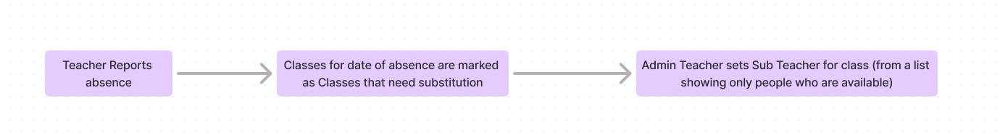
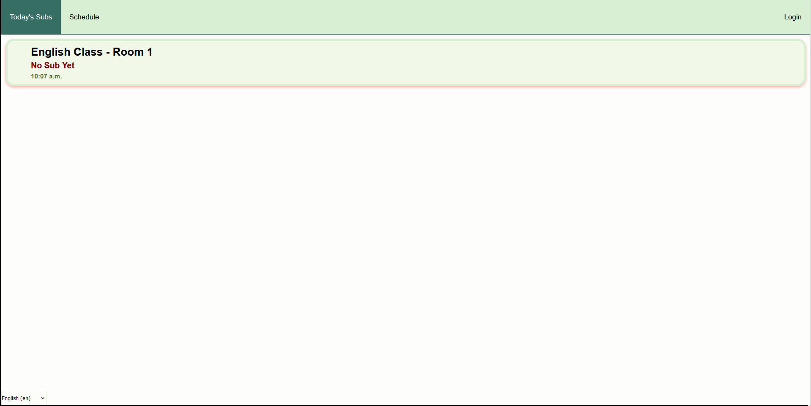
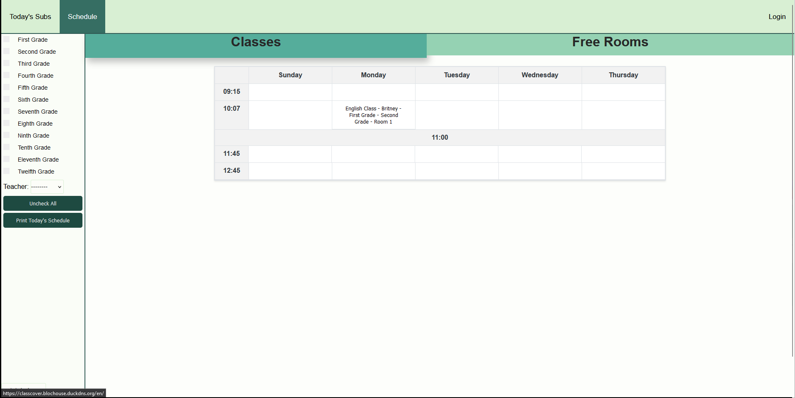
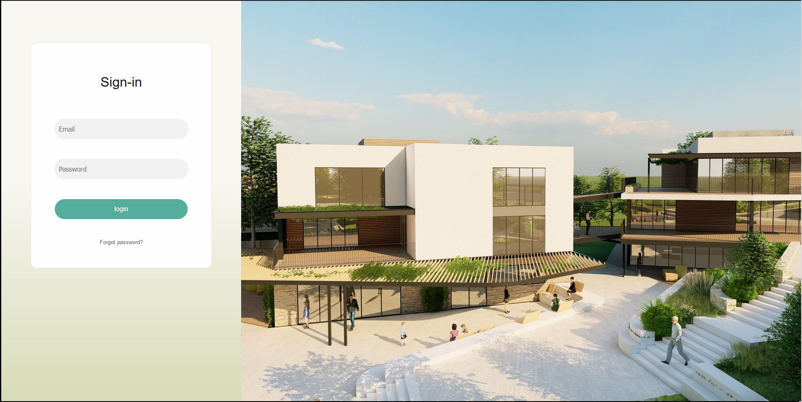
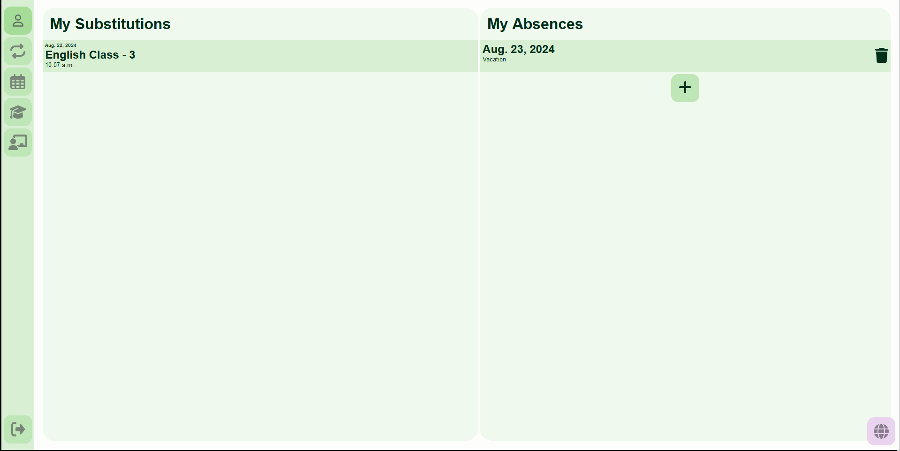
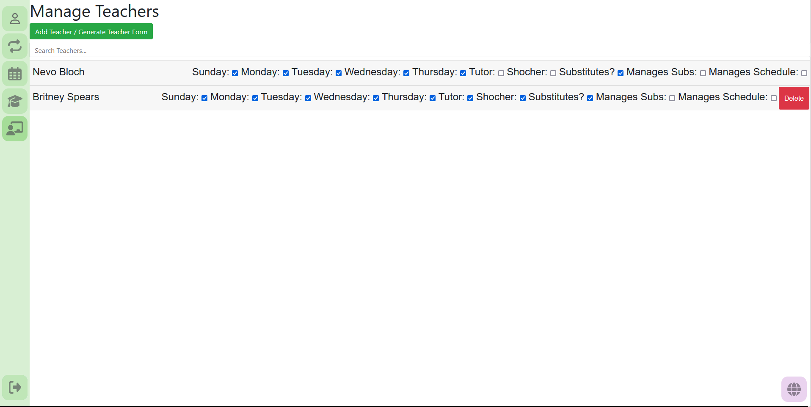
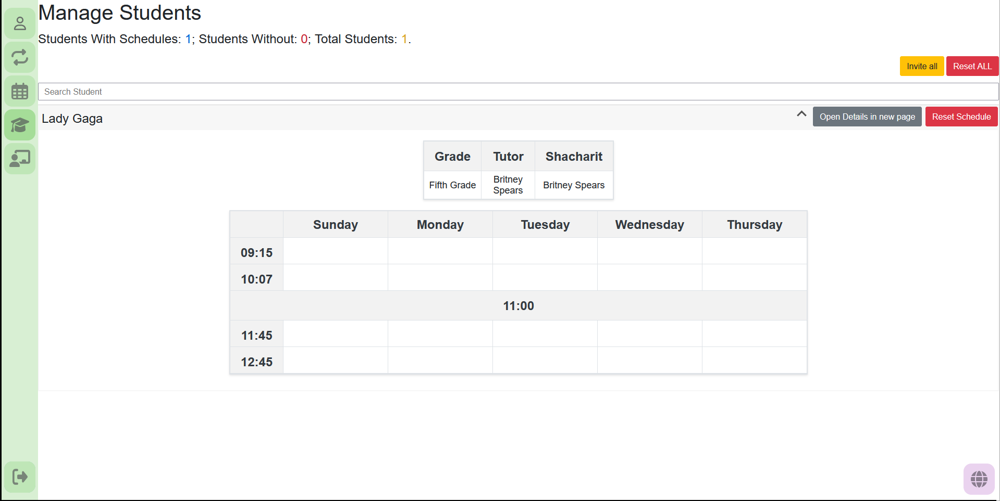

# School Schedule Management Project (Currently named ClassCover)
#### **RUNNING WITH INCLUDED DOCKER COMPOSE IS RECOMMENDED**

This is a school project (not homework!), the project started as a way to help school manage teacher substitutions,
A teacher (super teacher) enters all classes, and when teachers report Absences classes are marked that they need a Substitution,The super teacher then can mark who Substitutes that class.

as time passed this project grew to be more, currently as well as the substitution functionality
The school's Schedule is in and displayed in this website, and students set their schedule in it 

It is worth saying that while this project is generally developed for general use, it is tailored to **my** school's needs, so it will not fit every school, and actually probably won't fit most of them.

This project Is Not Done, and is in Constant Development. Planned features can be seen [here](https://trello.com/invite/b/66bf1a12e149d62e1081d4a0/ATTI775b626d4d09667dcce4dfae700f2e7a8C15D686/school-managment)

some environment variables need to be defined in an .env file:

| Key                  | Description                                                         |  
|----------------------|---------------------------------------------------------------------|
| EMAIL_HOST           | The host for the SMTP server                                        |
| EMAIL_USE_TLS        | Choose if SMTP should use TLS                                       |
| EMAIL_PORT           | SMTP Port                                                           |
| EMAIL_HOST_USER      | ------                                                              |
| EMAIL_HOST_PASSWORD  | ------                                                              |
| DEFAULT_FROM_EMAIL   | Email Sender                                                        |
| DB_USER              | Database Username                                                   |
| DB_PASSWORD          | Database password                                                   |
| DB_HOST              | Database Host IP                                                    |
| DB_NAME              | Database Name                                                       |
| DB_PORT              | Database Host Port, Also needs to be changed in docker-compose.yaml |
| DB_ROOT_PASSWORD     | Database Root Password                                              |
| DJANGO_SECRET_KEY    | The Django Secret Key (optional)                                    |
| DJANGO_DEBUG         | True or False, Choose if django should run in debug mode (optional) |
 | CSRF_TRUSTED_ORIGINS | a List containing Trusted domains                                   |
| FROM_EMAIL           | an email address from which emails will be sent                     |
| LAPTOPS_ENABLED      | True/False, whether the laptops feature should be enabled           |
 ### Pictures:
|                              |                              |
|------------------------------|------------------------------|
|  |  |
 |  |  |
|  |  |